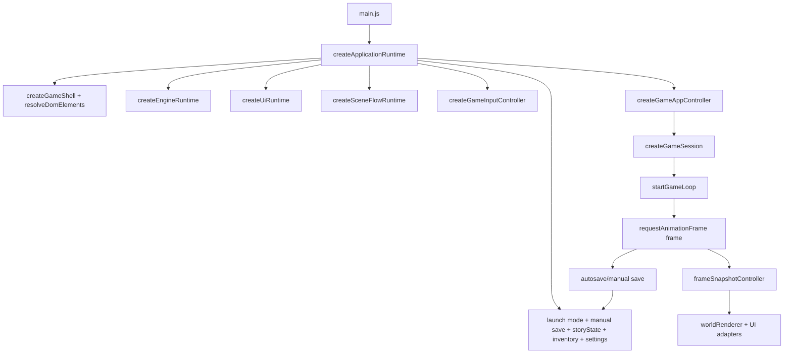
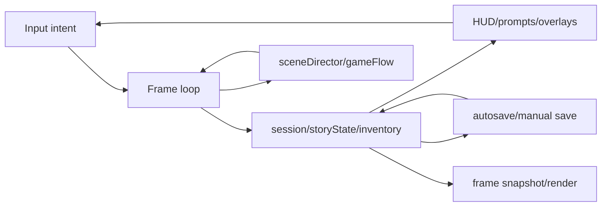

# Game Lifecycle Map

Este documento registra o primeiro corte seguro do lifecycle atual do jogo. Ele
nao substitui o grafo gerado por `npm run architecture:graph`; aqui o foco e o
fluxo operacional em runtime: boot, cenas, sessao, frame loop, progressao,
autosave e UI.

## Escopo desta passada

Arquivos lidos:

- `main.js`
- `app/bootstrap/createApplicationRuntime.js`
- `app/runtime/gameAppController.js`
- `app/gameSession.js`
- `app/runtime/createEngineRuntime.js`
- `app/runtime/createUiRuntime.js`
- `app/scene/createSceneFlowRuntime.js`
- `app/runtime/gameLoop.js`

Arquivos evitados nesta etapa:

- Camera de baixo nivel.
- Render frame interno.
- Stage scale.
- Input bindings detalhados.
- Renderer WebGL.
- Dados completos de quest, story beat, mundo e gameplay content.

## Grafo De Lifecycle

O grafo de importacao atual esta aciclico. O jogo, porem, tem ciclos
operacionais intencionais: frame loop, scene transitions, UI lazy loading,
progressao e autosave.

## Boot

`main.js` apenas cria o runtime e chama `app.start()`.

`createApplicationRuntime` e o hub principal. Ele:

- cria a shell DOM;
- resolve launch mode, flags e cena inicial;
- le localStorage/manual save;
- cria `inventory`, `storyState`, settings e runtimes de audio;
- cria engine, UI, cenas, input e autosave;
- monta `createGameAppController`;
- retorna o metodo `start`.

Risco: este arquivo mistura boot, save/load, wiring de UI, input, quest,
gameplay callbacks e integracao do loop. Qualquer refactor aqui deve extrair
constantes ou helpers puros primeiro, mantendo comportamento.

## Engine

`createEngineRuntime` concentra o setup tecnico visual:

- stage runtime;
- render frame controller;
- WebGL ou noop WebGL para launch modes especiais;
- camera Sandbots;
- camera orbit;
- renderer;
- texture factory;
- ponte `wireGameRuntime`.

Regra pratica: engine cria infraestrutura visual e retorna handles. Ela nao
deve receber regras de quest, coleta, construcao ou narrativa.

## UI

`createUiRuntime` cria controladores de HUD e overlays. A HUD principal e lazy:
se ainda nao carregou, chamadas importantes sao reexecutadas quando o modulo
fica pronto.

Responsabilidades observadas:

- HUD, notices, quest focus, missions e inventory UI;
- bag details;
- gameplay dialogue;
- visibility controller;
- world speech;
- collider gizmos;
- ground cell highlight;
- guide panel lazy;
- pokedex runtime.

Direcao segura: UI deve consumir snapshots e emitir intencao. Evitar colocar
regra de progressao ou mutacao direta de `storyState` aqui.

## Scene Flow

`createSceneFlowRuntime` monta o fluxo de cenas:

- start screen;
- intro sequence;
- intro room debug panel;
- act two cinematic;
- act two tutorial;
- scene director;
- game flow controller.

Transitions importantes:

- start screen `onStart` chama `onStartGame(selection)` e transiciona para
  `GAMEPLAY`;
- intro completa para `CINEMATIC`;
- cinematic completa para `TUTORIAL` ou cena configurada no workbench;
- tutorial completa para `GAMEPLAY`.

Risco: scene flow toca camera, overlays e estado de progresso inicial. Tratar
mudancas aqui como alto risco se envolver timing, camera, skip, input ou
ordem de renderizacao.

## Session

`createGameAppController.start()` cria a sessao antes de iniciar o loop.

`createGameSession` executa a montagem nesta ordem:

1. `createEmptySession`.
2. `loadSessionAssets`.
3. `buildSessionResources`.
4. `buildWorldLayout`.
5. `configurePlayerSpawner`.
6. `initializeGameplayState`.
7. `finalizeSessionBoot`.

Depois, `onSessionReady` em `createApplicationRuntime` aplica save pendente,
ativa cena inicial quando necessario, ajusta tutorial/gameplay e aplica launch
mode runtime.

Direcao segura: novas features de mundo devem entrar na sessao por dados e
builders especificos, nao por blocos grandes dentro do loop.

## Input

O input e criado em `createApplicationRuntime` e entregue ao loop como
consumidores de intencao:

- consume harvest/interact/destroy;
- camera look/zoom;
- movement and placement input;
- pause/settings/pokedex/workbench;
- active field move.

O loop nao le eventos DOM diretamente. Ele consome estado ja normalizado.

Direcao segura: bugs de input devem ser diagnosticados no contrato entre
`createGameInputController` e `controls` antes de alterar gameplay.

## Frame Loop

`startGameLoop` e o maior ponto de risco. Ele:

- inicia `frameSnapshotController`;
- cria camera directors e controladores de gameplay locais;
- executa `requestAnimationFrame(frame)`;
- calcula `deltaTime`;
- bloqueia movimento conforme cena, tutorial, dialogo, modal, skill overlay,
  cinematic e pausa;
- atualiza intro room, tutorial, cinematic e gameplay;
- consome intents de controle;
- muda `session`, `storyState` e `inventory`;
- coleta recursos;
- atualiza NPCs, particulas, efeitos, musica e prompts;
- monta `nextFrame`;
- chama `frameSnapshotController.commitFrame()`;
- agenda o proximo frame.

Regra pratica: nao refatorar `gameLoop.js` por dominio amplo. Extrair uma
sub-rotina por vez, com teste focado, mantendo a API do loop.

## Progressao E Save

`storyState`, `inventory` e `playerSkills` nascem em `createApplicationRuntime`
e sao compartilhados com UI, session e loop.

Autosave tambem nasce em `createApplicationRuntime`. O loop nao grava direto:
ele aciona callbacks entregues em `controls` ou `gameplay`, e esses callbacks
emitem quest events, sincronizam paineis e chamam `requestAutosave`.

Manual save usa `writeManualSavePoint`. No boot, o save e resolvido antes da
sessao, mas aplicado sobre a sessao em `onSessionReady`.

Risco: save/load, story flags e quest events formam o ciclo de maior chance de
regressao silenciosa. Refactors devem preservar ids internos e compatibilidade
de save.

## Ciclos Operacionais

Interpretacao:

- `input -> loop -> state` e o ciclo principal de gameplay.
- `state -> ui -> input` fecha a comunicacao jogador-sistema.
- `state -> save -> state` fecha persistencia entre sessoes.
- `scene <-> loop` controla intro, cinematic, tutorial e gameplay.
- `state -> render` transforma estado logico em frame visual.

## Pressao Arquitetural Atual

O grafo gerado em `docs/architecture-cycle-graph.md` nao encontra ciclos de
importacao, mas aponta hubs perigosos:

- `app/bootstrap/createApplicationRuntime.js`
- `app/runtime/gameLoop.js`
- `app/runtime/createUiRuntime.js`
- `app/runtime/createEngineRuntime.js`
- `app/scene/createSceneFlowRuntime.js`
- `gameplayContent.js`
- `world/islandWorld.js`

Isso indica que o problema principal nao e ciclo de importacao. O problema e
pressao de orquestracao: muitos dominios passam pelos mesmos hubs.

## Primeiros Cortes Seguros

1. Mapear uma feature ou bug para um ciclo operacional especifico antes de
   tocar codigo.
2. Evitar `gameLoop.js` como primeiro arquivo de mudanca, exceto se o bug for
   reproduzivel e localizado.
3. Preferir facades ou helpers puros em dominios ja existentes:
   `buildableCatalog`, `gridBuildingSystem`, quest/story beat data, save DTOs.
4. Quando precisar mexer no loop, extrair uma decisao pequena com contrato
   testavel.
5. Validar cada corte com teste focado e `npm run build` quando houver codigo.

## Proxima Fatia Recomendada

Escolher um ciclo operacional para auditar:

- **Start/load lifecycle**: start screen, save slot, manual save e cena inicial.
- **Gameplay frame lifecycle**: input intent, blockers, coleta e render snapshot.
- **Quest/progression lifecycle**: story beat, quest event, HUD e autosave.
- **Build lifecycle**: workbench, placement preview, confirmacao, save e render.

O melhor primeiro corte tecnico parece ser **quest/progression lifecycle** ou
**build lifecycle**, porque ambos ja tem testes e podem ser melhorados sem
alterar camera, render frame ou scene flow.
