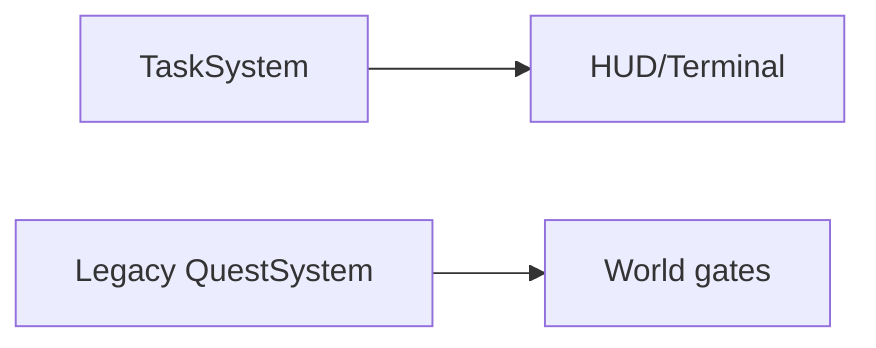

# Progression Gates Audit

Este documento registra uma passada curta sobre gates de progressao ainda
espalhados fora do novo `TaskSystem`. O objetivo nao e migrar tudo de uma vez,
mas identificar qual estado deveria ser dono de cada decisao para fechar a
coesao do jogo.

## Escopo Desta Passada

Arquivos inspecionados:

- `app/bootstrap/createApplicationRuntime.js`
- `world/gameplayInteractions.js`
- `app/runtime/gameLoop.js`
- `app/story/createStoryBeatSystem.js`
- `app/story/progressionTriggerContract.js`
- `app/story/progressionDiagnostics.js`
- `app/ui/createQuestLog.js`

Arquivos evitados:

- Camera, render frame e renderer.
- Dados completos de story beats.
- Conteudo completo de mundo.
- Refactor amplo do `gameLoop.js`.

## Estado Atual

O `TaskSystem` novo ja alimenta:

- HUD summary;
- HUD checklist principal;
- Colony PC task cards;
- manual save/load via `taskState`;
- eventos em shadow-write por `QuestTaskBridgeAdapter`.

Ainda nao alimenta de forma direta:

- gates de mundo;
- gates de dialogo;
- desbloqueio efetivo de habilidades;
- disponibilidade de acoes especiais;
- visibilidade de zonas de build;
- derivados antigos de field tasks.

O ponto mais importante: varios trechos usam variaveis chamadas
`activeSystemQuest`, mas o valor ainda vem de `questSystem.getActiveQuest()`.
Hoje, no adapter, esse metodo continua sendo o legacy `QuestSystem`, nao o novo
`TaskSystem`. Entao esses gates ainda sao legacy, mesmo com nome sugerindo que
sao o sistema novo.

## Gate Inventory

| Gate | Local atual | Estado usado hoje | Dono correto | Risco |
| --- | --- | --- | --- | --- |
| Restaurar habilidades em load | `createApplicationRuntime.js` `applySavedPlayerSkills` | `playerSkills`, `questState.unlocked`, quests antigas, flags | `playerSkills` como estado runtime; `TaskSystem` facts/effects como fonte permanente | Save antigo e novo podem divergir sobre habilidade liberada |
| Interagir com Chopper para report final | `createApplicationRuntime.js` e `world/gameplayInteractions.js` | `activeSystemQuest?.id === "chopper-first-habitat-report"` legacy | Task ativa `report-base-ready` ou fact `FIRST_BASE_READY` | HUD novo pode mostrar final enquanto dialogo ainda segue quest legacy |
| Guiar ate Colony Terminal | `createApplicationRuntime.js` `startRuinedPokemonCenterGuide` | `storyState.flags.pokemonCenterGuideFlightStarted`, `storyState.flags.challengesUnlocked` | Flag temporaria para voo; Task fact para terminal desbloqueado | Terminal pode estar completo no TaskSystem mas flag antiga bloquear/permitir diferente |
| Acoes da Colony PC | `getPokemonCenterPcActionForTask` | `storyState.flags.*` e field task ids | Task objectives/facts para main path; flags para side effects locais | Cards ja vem do TaskSystem, mas acoes ainda dependem de flags antigas |
| Build zone da primeira base | `gameLoop.js` `shouldShowFoundationBuildZone` | active quest legacy ou objective legacy `foundation-wall` | Task ativa `build-first-base` ou objective novo `build-twelve-foundation-walls` | Zona de build pode sumir se legacy e TaskSystem sairem de sincronia |
| Cue periodico para Chopper | `gameLoop.js` `getPeriodicChopperAttentionCue` | `activeSystemQuest?.id === "wake-guide"` legacy | Task ativa `wake-guide` | Ajuda visual inicial depende do sistema antigo |
| Emitir quest events por story beat | `createStoryBeatSystem.js` | `questSystem.emit` | API unica de progressao (`recordProgressEvent`) | Nome legacy continua vazando, mas shadow-write ja reduz risco |
| Triggers de colonia | `progressionTriggerContract.js` | `questSystem.emit` | API unica de progressao | Contrato ainda fala "quest", mas o adapter ja alimenta TaskSystem |
| Field tasks derivados | `createQuestLog.js` | `storyState.flags` e `trackedTaskIds` | Objetivos opcionais do TaskSystem, com flags so para estado fisico/local | Checklist principal migrou, mas derivados antigos continuam anexados |
| Diagnosticos de progressao | `progressionDiagnostics.js` | active quest legacy + field tasks | TaskSystem + comparacao contra legado durante migracao | Diagnostico ainda alerta sobre duplicidade antiga, nao sobre TaskSystem |

## Classificacao Dos Gates

### 1. Gates De Runtime Fisico

Devem continuar fora do `TaskSystem` quando representam estado fisico, visual ou
temporario:

- camera/voo em andamento;
- preview de placement;
- dialogo aberto;
- construcao em andamento;
- companion seguindo;
- objeto colocado no mundo.

Esses podem emitir eventos para o `TaskSystem`, mas nao devem virar task facts
sem necessidade.

### 2. Gates De Progressao Permanente

Devem migrar para `TaskSystem` facts/effects:

- Hydro Bot acordado;
- Bio-Grow liberado;
- Terminal inspecionado/desbloqueado;
- primeira base pronta;
- capitulo MVP completo;
- report final para Chopper.

Esses sao fatos permanentes do mundo ou da colonia.

### 3. Gates De Compatibilidade

Podem ler legacy por enquanto, mas devem ficar isolados:

- saves antigos sem `taskState`;
- `questState.unlocked`;
- ids antigos como `chopper-first-habitat-report`;
- field task ids antigos usados para acoes de terminal.

Esses gates devem ser tratados como adaptadores de migracao, nao como regra
nova.

## Principal Risco Encontrado

O jogo ja apresenta progresso pelo novo `TaskSystem`, mas partes do mundo ainda
desbloqueiam interacao e zonas por quest legacy. Isso cria o seguinte risco:



Se `taskState` e `questState` divergirem, o jogador pode ver um objetivo ativo
no HUD/terminal, mas o mundo responder com regras de outro ponto da campanha.

## Proximo Corte Seguro

Criar uma pequena facade de leitura de progressao, sem trocar gates ainda:

```js
questSystem.getActiveTask()
questSystem.hasTaskFact(factId)
questSystem.getTaskObjective(objectiveId)
```

Depois migrar apenas um gate de baixo risco:

- `getPeriodicChopperAttentionCue`: trocar de `activeSystemQuest?.id === "wake-guide"`
  para task ativa `wake-guide`.

Por que esse e o melhor primeiro corte:

- nao altera save;
- nao altera dialogo;
- nao altera construcao;
- nao altera disponibilidade de acoes;
- se falhar, afeta apenas uma dica visual inicial;
- testa o contrato de leitura do TaskSystem dentro do runtime real.

## Cortes A Evitar Agora

- Trocar todos os `storyState.flags` por facts.
- Reescrever `gameLoop.js`.
- Remover `QuestSystem`.
- Migrar todos os field tasks.
- Mudar save antigo por replay de quest events.

Esses passos exigem uma base de leitura mais estavel primeiro.
