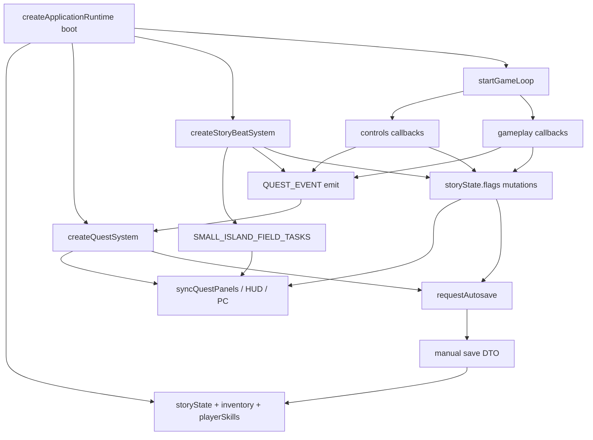
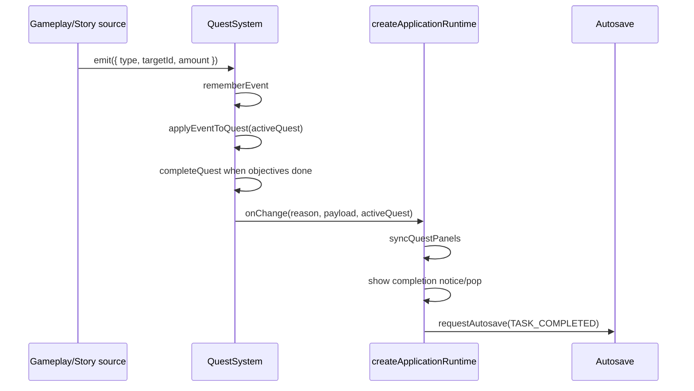
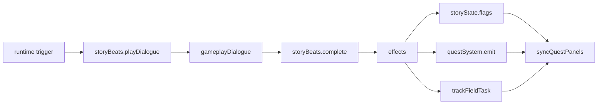
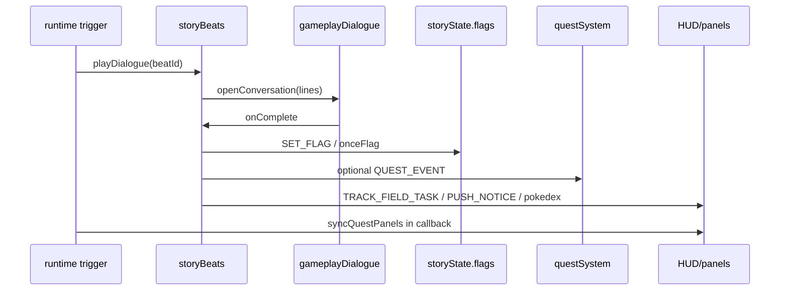

# Quest And Progression Flow Map

Este documento mapeia o fluxo atual de quest/progression sem propor refactor
imediato. O objetivo e tornar visivel como eventos de gameplay, story flags,
field tasks, story beats, HUD e autosave se conectam.

## Escopo Desta Passada

Arquivos lidos:

- `app/quest/createQuestSystem.js`
- `app/quest/questData.js`
- `app/quest/questFlowGuards.js`
- `app/story/createStoryBeatSystem.js`
- `app/story/storyBeatData.js`
- `story/progression.js`
- `app/bootstrap/createApplicationRuntime.js`
- `app/runtime/gameLoop.js`

Arquivos evitados nesta etapa:

- Renderer, camera, stage e WebGL.
- Dados completos de mundo.
- Testes detalhados.
- Dialogos completos.
- Todos os pontos de mutacao de `storyState.flags`.

## Resumo

Hoje existem tres camadas de progressao rodando em paralelo:

1. **Quest system formal**: `SMALL_ISLAND_QUESTS`, `createQuestSystem`,
   `QUEST_EVENT`, status, objectives e quest log.
2. **Progressao legada por story state**: `storyState.questIndex` e muitas
   flags em `story/progression.js`.
3. **Story beats + field tasks**: `SMALL_ISLAND_STORY_BEATS`,
   `SMALL_ISLAND_FIELD_TASKS`, efeitos, tracked tasks, dialogos e requests.

O sistema funciona porque `createApplicationRuntime.js` costura essas camadas:
ele cria o estado, cria o quest system, cria story beats, passa callbacks para
o loop e sincroniza UI/autosave quando alguma coisa muda.

## Grafo Geral



## Estado Dono Da Progressao

`story/progression.js` cria o estado inicial:

- `questIndex`: indice da lista legada `STORY_QUESTS` em `gameplayContent.js`.
- `flags`: grande tabela mutavel com marcos narrativos, construcoes, requests,
  tutoriais, seguidores, unlocks e progresso de tarefas.

Esse arquivo tambem expoe helpers de inventario, construcao e copy de progresso
para HUD. Isso faz dele uma camada legada de progressao e utilitarios, nao
apenas um modelo de quest.

Risco: `storyState.flags` e usado por quase todos os dominios. Mudancas em
nomes de flags ou semantica de flags quebram save, UI, missoes e cenas.

## Quest System Formal

Fonte de dados: `app/quest/questData.js`.

Componentes:

- `QUEST_EVENT`: `MOVE`, `TALK`, `COLLECT`, `PLACE`, `BUILD`, `PHOTO`,
  `UNLOCK`.
- `QUEST_STATUS`: `locked`, `available`, `active`, `completed`.
- `SMALL_ISLAND_QUESTS`: cadeia linear inicial:
  `learn-to-move -> wake-guide -> gather-first-supplies -> ...`.

Contrato:

- Cada quest possui `id`, `title`, `description`, `guidance`, `objectives`,
  `rewards` e `nextQuestId`.
- Objectives escutam eventos por `type` e `targetId`.
- Alguns objectives aceitam progresso lembrado por `acceptsRememberedProgress`.

Guards:

- `questFlowGuards.js` exige que a primeira quest seja sempre
  `learn-to-move`.
- A primeira quest deve iniciar ativa e exigir `MOVE:player` exatamente uma
  vez.
- `nextQuestId` precisa formar uma cadeia alcançavel, sem loops e sem ids
  faltantes.

## Runtime Do Quest System

`createQuestSystem` faz:

1. Clona quest data em estado mutavel.
2. Mescla estado salvo de storage ou manual save.
3. Garante a invariante da primeira quest.
4. Mantem:
   - `activeQuestId`;
   - `eventTotals`;
   - `unlocked`;
   - `completedQuestIds`;
   - `quests`.
5. Persiste estado opcionalmente em localStorage.
6. Emite `onChange` quando progresso muda.

Pipeline de evento:



Ponto importante: quest events podem vir de gameplay, controls ou story beat
effects. O quest system nao sabe quem causou o evento.

## Story Beats

Fonte de dados: `app/story/storyBeatData.js`.

`STORY_BEAT_IDS` nomeia momentos narrativos. Cada beat pode ter:

- `dialogueId`;
- `fallbackLines`;
- `onceFlag`;
- `effects`;
- `buildLines`.

`createStoryBeatSystem` executa beats. Ele:

- resolve linhas de dialogo;
- interpola nome do player;
- abre conversa em `gameplayDialogue`;
- marca `onceFlag`;
- aplica efeitos no final;
- pode completar sem abrir UI se o dialogo nao abrir.

Efeitos suportados:

- `QUEST_EVENT`: chama `questSystem.emit`.
- `TRACK_FIELD_TASK`: chama `trackFieldTask`.
- `SET_FLAG`: escreve em `storyState.flags`.
- `OPEN_POKEDEX_ENTRY`.
- `OPEN_DISCOVERED_HABITAT_POKEDEX`.
- `REGISTER_POKEDEX_REQUEST`.
- `OPEN_POKEDEX_REQUEST`.
- `UNLOCK_SKILL`.
- `PUSH_NOTICE`.
- `CUSTOM`.

Fluxo:



## Field Tasks

Fonte de dados: `SMALL_ISLAND_FIELD_TASKS` em `app/story/storyBeatData.js`.

Field tasks sao o checklist mais proximo da experiencia atual do MVP. Elas
possuem:

- `id`;
- `title`;
- `description` ou `description(storyState)`;
- `completeFlag`;
- `isComplete(storyState)` opcional;
- `subtasks(storyState)` opcional;
- `background` opcional.

Elas nao tem runtime proprio. Sao avaliadas contra `storyState.flags` quando a
UI precisa mostrar tarefas.

Conhecimento/visibilidade:

- `trackFieldTask(taskId)` adiciona o id em `storyState.flags.trackedTaskIds`.
- Algumas tasks aparecem por `completeFlag`, por `isComplete`, por status
  conhecido ou por acoes disponiveis no terminal.
- O PC/terminal junta field tasks e quest log formal em uma mesma lista.

Risco: field tasks sao player-facing, mas muitas vezes sao disparadas por story
beats ou flags soltas, nao por um grafo unico.

## Wiring Em createApplicationRuntime

`createApplicationRuntime` e o coordenador real da progressao.

Ele cria:

- `storyState = createStoryState()`;
- `inventory = createInitialInventory()`;
- `questSystem = createQuestSystem(...)`;
- `storyBeats = createStoryBeatSystem(...)`;
- callbacks `controls` e `gameplay` para o loop;
- `syncQuestPanels`;
- `requestAutosave`.

`syncQuestPanels` atualiza:

- quest focus;
- HUD instructions;
- mission cards.

`questSystem.onChange` faz:

- sincroniza paineis;
- se completou quest, mostra pop/notice;
- pode iniciar intro de reparo do Grow Bot;
- chama autosave `TASK_COMPLETED`.

`trackFieldTask`:

- adiciona o task id em `storyState.flags.trackedTaskIds`;
- sincroniza paineis;
- pode agendar foco de camera para task especifica.

## Pontos De Emissao De Quest Events

Eventos entram no quest system por varios caminhos.

### Movimento

No `gameLoop`, quando o player se move o suficiente e a quest ativa formal e
`learn-to-move`, o loop chama:

```txt
gameplay.recordQuestEvent({ type: MOVE, targetId: player })
```

Esse callback volta para `createApplicationRuntime`, que chama
`questSystem.emit`.

### Coleta

`gameLoop` coleta recursos chamando callbacks de `gameplay`, como:

- `collectWoodDrops`;
- `collectLeafDrops`;
- `collectLeafResourceNodes`;
- `collectCarbonResourceNodes`;
- `collectGearResourceNodes`;
- `collectLeppaBerryDrops`.

Esses callbacks:

- mutam inventario;
- atualizam UI de bag;
- tocam SFX;
- emitem `QUEST_EVENT.COLLECT`;
- sincronizam paineis.

### Acoes De Campo

Callbacks em `controls` emitem eventos como:

- `BUILD:snow-melted` quando fogo altera terreno;
- `BUILD:foundation-wall` quando parede da fundacao e construida.

Tambem podem acionar autosave silencioso para a primeira habilidade ensinada.

### Unlocks

`unlockPlayerSkill` marca skill no estado, sincroniza UI e, quando nao esta em
modo silencioso, emite:

```txt
QUEST_EVENT.UNLOCK targetId: skillId
```

Depois chama autosave `NEW_ABILITY_LEARNED`.

### Story Beats

Story beats podem emitir quest events como efeito. Exemplo estrutural:

```txt
STORY_BEAT_EFFECT.QUEST_EVENT -> questSystem.emit(effect.event)
```

Isso conecta dialogos e marcos narrativos ao quest system formal.

## UI E Missao Ativa

O loop consulta duas ideias de quest:

- `gameplay.getActiveQuest(storyState)`: quest legada via `story/progression.js`.
- `gameplay.getActiveSystemQuest()`: quest formal via `questSystem.getActiveQuest()`.

O prompt final pode usar:

- targets de gameplay;
- quest legada;
- quest formal;
- transient notices;
- pending placement;
- field task prompts.

O HUD recebe `storyState`, `inventory`, player position e prompt copy por
`nextFrame.hud`. Separadamente, `syncQuestPanels` atualiza paineis quando algo
muda fora do frame normal.

Risco: a UI mistura fonte formal e fonte legada. Isso pode gerar missao ativa
visual diferente do estado formal se as duas camadas divergirem.

## Save E Restore

Persistencia acontece por dois caminhos:

1. `questSystem` pode persistir seu proprio estado em localStorage quando
   `ENABLE_QUEST_PERSISTENCE` esta ativo.
2. Manual/autosave serializa um save point que inclui `storyState`,
   `inventory`, `playerSkills`, `questState` e estado de sessao.

No boot:

- `createApplicationRuntime` resolve manual save ativo;
- `createQuestSystem` recebe `initialState` vindo do save point;
- `applyManualSaveState` aplica `storyState`, inventario, skills e perfil;
- `restoreSavedSessionState` aplica estado salvo sobre a sessao pronta.

Risco: existem duas persistencias possiveis para quest state: localStorage do
quest system e manual save. O initial state do save point reduz esse risco no
boot com save manual, mas o ownership ainda precisa ficar explicito em futuros
refactors.

## Divergencias Arquiteturais Atuais

### 1. Quest formal vs quest legada

`questSystem.getActiveQuest()` e `getActiveQuest(storyState)` podem representar
coisas diferentes. O primeiro usa `SMALL_ISLAND_QUESTS`; o segundo usa
`STORY_QUESTS` por `questIndex`.

### 2. Field tasks sao o checklist mais fiel ao MVP

O proprio mapa de MVP ja indica que field tasks refletem melhor o jogo atual.
Elas dependem de flags e story beats, nao do quest system formal.

### 3. Progressao e feedback estao acoplados

Varios callbacks fazem em sequencia:

```txt
mutar estado -> emitir quest event -> tocar som -> push notice -> sync UI -> autosave
```

Isso funciona, mas torna dificil testar uma unica regra de progressao sem
arrastar UI/audio/autosave.

### 4. `createApplicationRuntime` e o hub principal

Ele conhece quase todos os eventos de progressao. Refactor seguro deve extrair
helpers puros ou contratos pequenos, nao mover tudo de uma vez.

## Fluxo Completo De Um Evento Tipico

Exemplo: coletar Wood durante gameplay.

```mermaid
sequenceDiagram
  participant Loop as gameLoop
  participant Gameplay as gameplay.collectWoodDrops
  participant Inv as inventory/storyState
  participant QS as questSystem
  participant UI as HUD/panels
  participant Save as autosave

  Loop->>Gameplay: collectWoodDrops(position, drops, inventory)
  Gameplay->>Inv: add Wood / update challenge counters
  Gameplay->>UI: bag feedback + sound + notice
  Gameplay->>QS: emit(COLLECT:wood, amount)
  QS->>QS: update active objective
  QS->>UI: onChange -> syncQuestPanels
  QS->>Save: TASK_COMPLETED if quest completed
  Loop->>UI: nextFrame.hud gets latest storyState/inventory
```

Exemplo: completar um story beat.



## Melhor Proximo Corte

O proximo corte seguro deve escolher uma das duas direcoes:

1. **Mapa de ownership sem runtime change**
   Criar uma tabela de ownership para cada task/beat/quest:
   fonte, flag principal, evento formal, UI que mostra, autosave esperado.

2. **Helper puro para leitura de field tasks**
   Extrair ou consolidar apenas funcoes puras de:
   `isFieldTaskComplete`, `isFieldTaskKnown`, `getFieldTaskDescription`.
   Isso melhora testabilidade sem tocar no loop.

Evitar por enquanto:

- Unificar `questIndex` com `questSystem`.
- Mover quest emissions para fora do loop em massa.
- Renomear flags.
- Mudar save DTO.
- Alterar scene flow ou camera como parte deste tema.
