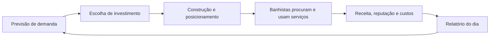
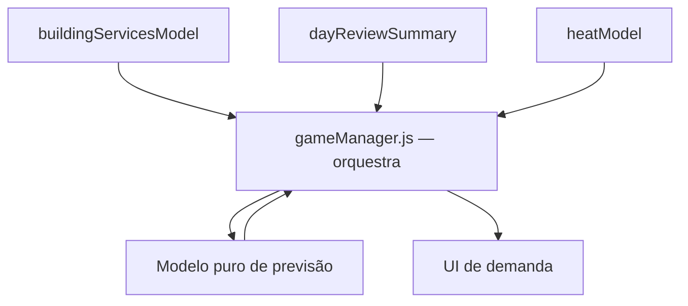
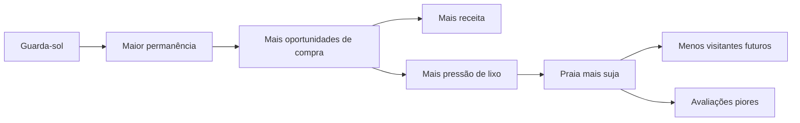
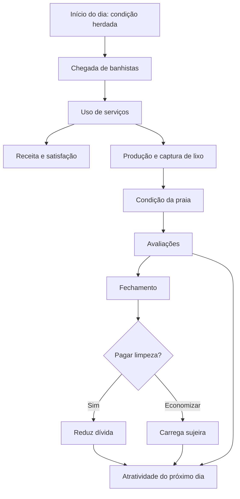

# Tasks — Coesão de gameplay e economia

Este documento registra as features selecionadas durante o pente-fino de
economia e gameplay. Ele descreve intenção de design, regras observáveis pelo
jogador, limites de escopo e critérios de aceite. Não substitui o preflight
técnico obrigatório antes de cada etapa de implementação.

---

## Feature 01 — Mapa de Demanda da Praia

**Estado:** implementada e validada
**Prioridade:** primeira
**Origem da decisão:** opção 1 do primeiro top 5
**Tipo:** clareza econômica, orientação do jogador e feedback de causa e efeito

### 1. Problema que a feature resolve

O jogo já possui partes importantes de uma economia:

- Banhistas têm necessidades.
- Construções anunciam utilidade para necessidades específicas.
- Banhistas escolhem e usam serviços.
- Alguns serviços geram receita por uso.
- Serviços públicos podem receber verba e possuir manutenção.
- A experiência do banhista influencia avaliações.
- O dia termina com um relatório.

Apesar disso, o jogador ainda não consegue formar com facilidade o seguinte
modelo mental:

> Há uma necessidade na praia, uma construção pode atendê-la, os banhistas
> usam essa construção, o atendimento produz dinheiro ou reputação e esse
> resultado permite o próximo investimento.

Sem essa leitura, a compra de uma construção pode parecer uma escolha
decorativa ou aleatória. O dinheiro cresce, mas o jogador não sabe com
segurança:

- Por que ganhou.
- O que deixou de ganhar.
- Qual problema uma construção resolveu.
- Qual necessidade ainda está descoberta.
- Qual investimento faz sentido para o próximo dia.

### 2. Objetivo da feature

Transformar a economia existente em uma cadeia legível de decisões:

1. O jogo apresenta as pressões de demanda do dia.
2. O jogador identifica quais necessidades estão descobertas.
3. As construções explicam que necessidade atendem e como retornam valor.
4. O jogador investe e posiciona uma construção.
5. Os banhistas demonstram que procuram e utilizam aquele serviço.
6. O jogo atribui dinheiro, reputação e problemas ao serviço correspondente.
7. O fechamento do dia compara previsão, atendimento e demanda perdida.
8. O jogador usa essa leitura para decidir o próximo investimento.

O objetivo não é revelar a fórmula inteira nem garantir lucro. O objetivo é
dar informação suficiente para uma decisão consciente.

### 3. Princípios de design

#### 3.1 Mostrar causas, não apenas resultados

Um aumento de dinheiro precisa estar associado visualmente ao banhista e à
construção que produziram a receita. Uma queda de avaliação deve apontar para
uma necessidade não atendida.

#### 3.2 Usar faixas, não falsas promessas

O jogo deve comunicar demanda como `baixa`, `média` ou `alta`. Não deve
prometer uma quantidade exata de clientes ou receita quando o comportamento
dos banhistas ainda depende de distância, capacidade, disponibilidade e
variação da partida.

#### 3.3 Separar demanda de cobertura

Demanda e cobertura são informações diferentes:

- **Demanda:** intensidade esperada de uma necessidade.
- **Cobertura:** existência e estado de um serviço capaz de atendê-la.

Uma necessidade pode ter demanda alta e já estar bem coberta. Outra pode ter
demanda média, mas nenhuma cobertura, tornando-se uma prioridade maior.

#### 3.4 Toda recomendação precisa de uma razão

O jogo não deve apenas marcar uma construção como “recomendada”. Deve explicar
o motivo, por exemplo:

- “Onda de calor: muita procura por refresco.”
- “Ontem, três visitantes reclamaram de Wi-Fi.”
- “Nenhum serviço atende entretenimento.”
- “O banheiro está fechado por falta de manutenção.”

#### 3.5 Preservar escolha e descoberta

O mapa orienta, mas não joga pelo jogador. Ele não deve:

- Selecionar uma construção automaticamente.
- Esconder todas as opções consideradas subótimas.
- Revelar resultados exatos da simulação futura.
- Eliminar estratégias experimentais.

### 4. Referências de design aplicadas

#### The Sims Design Documents

As interações de um objeto anunciam benefícios para diferentes necessidades.
O personagem compara a melhoria esperada, sua situação atual, disponibilidade
e distância antes de escolher uma ação.

Aplicação no Beach Simulator:

- Cada construção mantém sua relação explícita com uma necessidade.
- A atratividade continua sendo contextual.
- O jogador passa a enxergar a mesma relação que a simulação já utiliza.

#### Game Mechanics: Advanced Game Design

Economias interessantes precisam tornar visíveis fontes, drenos, conversores,
feedback e efeitos ao longo do tempo. Decisões frequentes devem influenciar o
sistema sem fazer uma única escolha resolver a partida inteira.

Aplicação no Beach Simulator:

- Receita, manutenção, verba pública e demanda perdida aparecem no mesmo ciclo.
- A previsão orienta decisões, mas o resultado depende da execução do dia.
- O relatório fecha o ciclo de feedback.

#### Rethinking Economy-Building Video Games

Jogadores respondem bem a metas compreensíveis, efeitos tangíveis e
oportunidades de revisar a estratégia. A progressão perde força quando o
dinheiro se acumula sem propósito ou quando o sistema já foi completamente
“resolvido”.

Aplicação no Beach Simulator:

- A necessidade do dia cria contexto para cada novo investimento.
- O resultado é comparado com um referencial compreensível.
- Problemas não resolvidos alimentam o próximo dia.

### 5. Vocabulário do sistema

#### Necessidade

Motivo que influencia o comportamento de um banhista:

- `refreshment` — refresco.
- `safety` — segurança.
- `connectivity` — conectividade.
- `relief` — alívio/banheiro.
- `cleanliness` — limpeza.
- `entertainment` — entretenimento.

#### Pressão de demanda

Estimativa da intensidade de uma necessidade para o dia atual:

- Baixa.
- Média.
- Alta.

#### Cobertura

Situação do serviço correspondente:

- **Sem cobertura:** nenhuma construção atende a necessidade.
- **Disponível:** existe um serviço operacional.
- **Degradada:** existe um serviço, mas ele está fechado, sem manutenção ou
  incapaz de operar.

#### Prioridade

Combinação de pressão de demanda, ausência de cobertura e problemas do dia
anterior. A prioridade serve para ordenar a apresentação; ela não altera
diretamente o comportamento dos banhistas.

#### Atendimento perdido

Tentativa ou necessidade relevante que não foi atendida porque:

- Não havia serviço correspondente.
- O serviço estava indisponível.
- O banhista desistiu ou deixou a praia.

No MVP, só deve ser contabilizado o que puder ser atribuído com segurança a um
evento já existente. Não criar estimativas invisíveis apresentadas como fatos.

### 6. Entradas da previsão

O modelo deve receber dados por parâmetro. Ele não pode importar ou consultar
`gameManager.js` diretamente.

#### Entradas obrigatórias do MVP

- Nível atual de calor ou clima.
- Problemas agregados nas avaliações do dia anterior.
- Tipos de construção possuídos.
- Estado operacional dos serviços existentes.
- Dia atual da partida.

#### Entradas posteriores, somente se houver fonte confiável

- Composição prevista dos perfis de banhistas.
- Eventos especiais.
- Capacidade e filas.
- Histórico de demanda de vários dias.

Não adicionar essas entradas ao MVP por aproximação especulativa.

### 7. Regras da previsão

#### 7.1 Demanda-base

Cada necessidade começa em uma faixa neutra configurável. Essa base evita que
uma necessidade desapareça completamente quando não existe modificador
especial.

#### 7.2 Modificadores conhecidos

Exemplos iniciais:

- Calor alto aumenta a pressão por refresco.
- Problema `heat-without-beverage` aumenta a prioridade de refresco.
- Problema `missing-wifi` aumenta a prioridade de conectividade.
- Problema `missing-toilet` aumenta a prioridade de alívio.
- Problema `missing-entertainment` aumenta a prioridade de entretenimento.
- Serviço existente, mas inoperante, marca cobertura degradada.

Esses modificadores devem reaproveitar conceitos já presentes no jogo. Não
criar uma segunda taxonomia de problemas com significados concorrentes.

#### 7.3 Conversão para faixas

Os valores internos podem ser numéricos, mas a interface mostra apenas:

- Baixa.
- Média.
- Alta.

Os limites devem ficar centralizados no modelo de previsão e ser testáveis.

#### 7.4 Ordenação

As necessidades são ordenadas por:

1. Problema persistente do dia anterior.
2. Demanda alta sem cobertura.
3. Demanda alta com cobertura degradada.
4. Demanda alta já coberta.
5. Demais necessidades.

Empates devem manter uma ordem estável para evitar que a interface pareça
aleatória.

#### 7.5 Explicações

Cada previsão retorna ao menos uma razão legível. A razão deve vir de um
identificador traduzível e parâmetros, nunca de texto montado dentro do modelo.

Exemplo conceitual:

```js
{
  motive: "refreshment",
  demandBand: "high",
  coverage: "missing",
  reasonId: "demand.reasons.highHeat",
  recommendedBuildingType: "beverage-store"
}
```

Esse formato é ilustrativo. O contrato final deve seguir os padrões existentes
do projeto.

### 8. Experiência do jogador

#### 8.1 Introdução do dia

A introdução mostra no máximo três pressões principais para não sobrecarregar
a tela lógica de `480 x 272`.

Cada item contém:

- Ícone da necessidade.
- Faixa de demanda.
- Estado de cobertura.
- Uma razão curta.

Exemplo:

> REFRESCO — ALTA
> Onda de calor. Nenhuma loja disponível.

A apresentação precisa caber no stage sem rolagem obrigatória.

#### 8.2 Escolha de construção

Cada carta de construção passa a mostrar:

- Necessidade atendida.
- Demanda atual daquela necessidade.
- Estado atual de cobertura.
- Modelo econômico:
  - receita por uso;
  - verba pública;
  - manutenção diária;
  - ou combinação aplicável.
- Razão da recomendação, quando houver.

Não apresentar “lucro previsto” exato no MVP.

Exemplos de rótulos:

- “Demanda alta.”
- “Gera receita durante o uso.”
- “Serviço público: recebe verba.”
- “Custo diário de manutenção.”
- “Você ainda não possui cobertura.”

#### 8.3 Feedback durante o dia

O jogo deve preservar os balões e feedbacks já existentes de intenção,
conclusão e dinheiro.

O MVP deve garantir que:

- A intenção do banhista use o mesmo motivo anunciado pela construção.
- O término do serviço seja perceptível.
- A receita viaje visualmente da origem para o contador.
- Uma necessidade não atendida produza feedback compreensível, sem poluir a
  tela com mensagens repetidas.

Não criar um painel permanente grande no gameplay inicial.

#### 8.4 Fechamento do dia

O relatório apresenta:

- Necessidades previstas como prioritárias.
- Quantas foram cobertas ou continuaram descobertas.
- Serviços que mais ajudaram.
- Receita atribuída a serviços.
- Custos de manutenção.
- Verba pública recebida.
- Principal demanda perdida.
- Indicação do que merece atenção no dia seguinte.

O relatório deve distinguir:

- Receita comercial.
- Apoio público.
- Custos.
- Avaliação dos visitantes.

Esses valores não devem ser somados sob um rótulo genérico de “ganhos”.

### 9. Loop econômico resultante



O mapa de demanda fecha esse ciclo. Ele não adiciona uma moeda nova e não muda
os valores de balanceamento na primeira versão.

### 10. Integração com os sistemas atuais

#### Dados que devem ser reaproveitados

- Anúncios de serviço de `buildingServicesModel`.
- Definições econômicas de `beachObjectCatalog`.
- Estado de calor já existente.
- Problemas agregados das avaliações.
- Eventos de decisão e conclusão de serviço.
- Eventos de receita.
- Encerramento diário e relatório.

#### Dados que não devem ser duplicados

- Relação entre tipo de construção e motivo.
- Custos de manutenção.
- Valores de receita.
- Identificadores dos problemas de avaliação.
- Estado operacional do banheiro e do guarda-vidas.

Deve existir uma única fonte de verdade para cada um desses dados.

### 11. Direção arquitetural

O modelo de previsão deve ser puro e receber snapshots:



Restrições:

- O modelo de previsão não importa `gameManager.js`.
- A UI não consulta diretamente NPCs, economia ou mundo.
- O renderer não conhece regras de demanda.
- O sistema não cria estado global mutável.
- O `gameManager` apenas coleta snapshots, chama o modelo e entrega um DTO à
  apresentação.

### 12. Escopo do MVP

O MVP inclui:

- Previsão das seis necessidades já existentes.
- Modificadores de calor e problemas do dia anterior.
- Cobertura ausente, disponível ou degradada.
- Três prioridades na introdução do dia.
- Contexto de demanda nas cartas de construção.
- Resumo de cobertura no fechamento diário.
- Testes do modelo de previsão.

O MVP não inclui:

- Previsão monetária exata.
- Novos perfis de banhistas.
- Capacidade ou filas.
- Novas construções.
- Novas moedas.
- Árvore de upgrades.
- Alteração de preços.
- Alteração da fórmula de avaliação.
- Rebalanceamento global.
- Mudança de câmera, stage, renderer ou resolução.

### 13. Implementação em etapas pequenas

Cada etapa exige novo preflight e deve permanecer em até três arquivos sempre
que possível.

#### Etapa A — Contrato puro de previsão

- [x] Definir o snapshot de entrada.
- [x] Definir o DTO de saída.
- [x] Implementar cálculo de demanda, cobertura, prioridade e razões.
- [x] Criar testes unitários para faixas, modificadores e ordenação.

**Critério de saída:** o modelo funciona sem DOM, renderer ou `gameManager`.

#### Etapa B — Introdução do dia

- [x] Adaptar a apresentação existente para receber até três previsões.
- [x] Garantir layout dentro de `480 x 272`.
- [x] Adicionar textos traduzíveis em uma etapa isolada.
- [x] Validar visualmente em inglês e português.

**Critério de saída:** o jogador entende as principais necessidades antes do
dia começar.

#### Etapa C — Cartas de construção

- [x] Entregar o snapshot de demanda à escolha de construção.
- [x] Mostrar necessidade, faixa de demanda e modelo econômico.
- [x] Explicar recomendações.
- [x] Manter até três opções e preservar a escolha do jogador.

**Critério de saída:** cada opção informa por que seria útil naquele dia.

#### Etapa D — Atribuição do resultado

- [x] Contabilizar usos concluídos por tipo de serviço.
- [x] Contabilizar receita por tipo de serviço.
- [x] Registrar apenas atendimentos perdidos comprováveis.
- [x] Evitar duplicação entre receita da bebida e receita periódica.

**Critério de saída:** os números do relatório podem ser rastreados a eventos
reais.

#### Etapa E — Fechamento do dia

- [x] Comparar prioridades previstas com cobertura alcançada.
- [x] Separar receita, verba pública e custos.
- [x] Mostrar principal demanda ainda descoberta.
- [x] Alimentar a previsão do próximo dia com problemas reais.

**Critério de saída:** o jogador consegue explicar por que ganhou dinheiro e o
que deve considerar em seguida.

### 14. Critérios de aceite funcionais

#### Cenário 1 — Onda de calor sem loja

**Dado** calor alto e ausência de loja de bebidas,
**quando** a previsão do dia for criada,
**então** refresco aparece como demanda alta e sem cobertura, com uma razão
ligada ao calor.

#### Cenário 2 — Reclamação persistente

**Dado** que o principal problema do dia anterior foi falta de Wi-Fi,
**quando** o próximo dia começar,
**então** conectividade recebe prioridade e a recomendação explica a
reclamação anterior.

#### Cenário 3 — Serviço público degradado

**Dado** que existe banheiro, mas ele está inoperante,
**quando** a cobertura de alívio for calculada,
**então** ela aparece como degradada, não como disponível nem ausente.

#### Cenário 4 — Construção comercial

**Dado** uma opção que gera receita por uso,
**quando** sua carta for apresentada,
**então** ela informa esse modelo econômico sem prometer receita exata.

#### Cenário 5 — Construção pública

**Dado** uma opção sustentada por verba pública e manutenção,
**quando** sua carta for apresentada,
**então** verba e custo diário aparecem como conceitos separados.

#### Cenário 6 — Fechamento atribuível

**Dado** que uma construção foi usada durante o dia,
**quando** o relatório for exibido,
**então** usos, receita e custos mostrados correspondem a eventos registrados,
sem estimativas apresentadas como fatos.

#### Cenário 7 — Tela pequena

**Dado** o stage lógico de `480 x 272`,
**quando** introdução, cartas e relatório forem renderizados,
**então** todo conteúdo principal permanece dentro do stage, sem corte ou
redimensionamento da câmera.

### 15. Testes mínimos

- [x] Demanda-base de todas as necessidades.
- [x] Modificador de calor.
- [x] Modificador para cada problema de avaliação existente.
- [x] Cobertura ausente.
- [x] Cobertura disponível.
- [x] Cobertura degradada.
- [x] Ordenação estável em empates.
- [x] Limite de três previsões na apresentação.
- [x] Ausência de previsão monetária exata.
- [x] Não duplicação de receita no relatório.
- [x] Layout visual em `480 x 272`.
- [x] Tradução em português e inglês.

### 16. Riscos e mitigação

#### A previsão parecer uma promessa

**Mitigação:** usar faixas e linguagem como “procura esperada”, nunca “você
ganhará”.

#### Excesso de informação

**Mitigação:** mostrar somente três prioridades na introdução e usar detalhes
adicionais apenas nas cartas e no relatório.

#### Duplicação de regras econômicas

**Mitigação:** o modelo consulta definições recebidas da fonte existente; não
mantém cópias de preços, receitas ou manutenção.

#### Recomendações sempre produzirem a mesma estratégia

**Mitigação:** recomendações explicam pressões, mas não bloqueiam outras
opções. Empates e múltiplas necessidades preservam decisões diferentes.

#### Relatório alegar causalidade inexistente

**Mitigação:** separar dados observados de estimativas e contabilizar somente
eventos com origem identificável.

#### Escopo crescer para uma reformulação econômica

**Mitigação:** não alterar preços, receitas, spawn, avaliação ou duração da
partida durante o MVP.

### 17. Decisões que ainda exigem pente-fino

- [x] Escolher os limites internos das faixas baixa, média e alta.
- [x] Definir quais informações cabem na introdução de `480 x 272`.
- [x] Definir se limpeza e segurança aparecem como demanda, condição global ou
  ambos.
- [x] Definir o tratamento visual de cobertura degradada.
- [x] Determinar quais eventos atuais comprovam atendimento perdido.
- [x] Definir a janela de persistência de problemas anteriores.
- [x] Decidir se o relatório mostra valores monetários por construção ou apenas
  totais por categoria no MVP.

Essas decisões devem ser tomadas antes do código da etapa correspondente, não
resolvidas por condicionais improvisadas durante a implementação.

### 18. Definição de pronto

A feature estará pronta somente quando:

- [x] O jogador vê as três principais pressões antes do dia.
- [x] Cada pressão possui causa e cobertura compreensíveis.
- [x] As cartas explicam necessidade e modelo econômico.
- [x] O feedback ao vivo conecta banhista, serviço e resultado.
- [x] O fechamento separa receita, verba, custo e demanda perdida.
- [x] O próximo dia responde aos problemas observados.
- [x] Nenhuma regra econômica possui duas fontes de verdade.
- [x] O stage, a câmera e a resolução permanecem inalterados.
- [x] Testes do modelo passam.
- [x] A apresentação foi validada visualmente em `480 x 272`.

---

## Feature 02 — Ecossistema Persistente da Praia

**Estado:** implementada e validada
**Prioridade:** segunda
**Origem da decisão:** combinação das opções 4 e 5 do segundo top 5
**Tipo:** consequências entre dias, sinergias de serviço e equilíbrio econômico

### 1. Decisão de design

Esta feature combina dois conceitos que precisam funcionar como um único
ecossistema:

1. Decisões deixam consequências que persistem no dia seguinte.
2. Construções se complementam por meio do comportamento dos banhistas.

As relações escolhidas são:

- Economizar na limpeza aumenta o lixo do dia seguinte.
- Loja de bebidas gera dinheiro e também gera risco de lixo.
- Loja de bebidas com lixeiras mantém a atividade comercial e controla parte do
  lixo, mas não aumenta diretamente o número de banhistas.
- Guarda-sol ajuda a aumentar a quantidade de banhistas e, portanto, cria mais
  oportunidades de avaliação.
- Guarda-sol com loja aumenta a permanência e cria novas oportunidades de
  compra.
- Mais permanência e compras também produzem mais lixo.
- Praia suja afasta turistas e reduz avaliações.
- Quadra com guarda-vidas melhora entretenimento e segurança, aumentando
  satisfação e avaliação, mas não gera dinheiro diretamente.
- Banheiro bem mantido permite que visitantes permaneçam por mais tempo.

Essas relações não devem ser implementadas como uma lista de bônus percentuais
ocultos. Sempre que possível, o efeito deve acontecer pela cadeia causal real:

> construção → comportamento → consequência → economia ou avaliação

### 2. Problema que a feature resolve

Atualmente, construções podem ser percebidas como vantagens isoladas. O jogador
compra um objeto, recebe um benefício e segue acumulando dinheiro. Isso limita a
gestão de recursos porque:

- Uma construção não cria problemas que outra construção possa resolver.
- A condição da praia tem pouco peso econômico entre os dias.
- Serviços que não geram dinheiro parecem inferiores aos serviços comerciais.
- Permanência, atração, satisfação e receita podem parecer a mesma coisa.
- Lixo coletado e lixo ignorado não formam uma trajetória econômica clara.
- O jogador tem pouco motivo para reservar dinheiro para prevenção.

O ecossistema deve fazer cada construção ocupar um papel distinto. Uma
construção comercial produz caixa, mas também pressão ambiental. Uma
infraestrutura pública protege permanência ou satisfação. Uma amenidade atrai
visitantes, mas aumenta a carga sobre todos os demais serviços.

### 3. Objetivo da feature

Criar uma rede de causa e efeito na qual o jogador precise equilibrar:

- Receita direta.
- Quantidade de visitantes.
- Tempo de permanência.
- Satisfação.
- Avaliação.
- Produção de lixo.
- Capacidade de controle do lixo.
- Custo de limpeza.
- Condição herdada pelo próximo dia.

O sistema deve permitir estratégias diferentes, mas nenhuma construção deve
resolver sozinha todos esses eixos.

### 4. Recursos e indicadores

#### 4.1 Dinheiro

Recurso que paga novas construções, manutenção e limpeza. Pode vir de:

- Compras na loja de bebidas.
- Outras receitas comerciais já existentes.
- Aluguel de guarda-sol, enquanto essa receita permanecer no balanceamento.
- Verba pública já existente.
- Recompensas já existentes.

Cada origem continua identificável. Não criar uma receita genérica de
“sinergia”.

#### 4.2 Atratividade

Indicador usado para influenciar quantos banhistas desejam visitar a praia.

Pode aumentar com:

- Disponibilidade de guarda-sóis.
- Boa avaliação acumulada.
- Condição limpa da praia.

Pode diminuir com:

- Lixo acumulado.
- Avaliação baixa.
- Problemas persistentes.

Atratividade não adiciona NPCs diretamente ao mundo. Ela deve ser entregue ao
sistema responsável por spawn como um parâmetro limitado.

#### 4.3 Permanência

Tempo durante o qual um banhista continua elegível para atividades na praia.

Pode aumentar quando:

- O banhista consegue descansar à sombra.
- Sua necessidade de banheiro é atendida.
- Uma combinação de conforto e serviços mantém suas necessidades sob controle.

Permanência maior cria oportunidades; ela não garante compras nem avaliações
positivas.

#### 4.4 Satisfação

Resultado do atendimento das necessidades de cada banhista. É individual e
deve continuar derivado dos motivos existentes.

#### 4.5 Avaliação

Resultado produzido quando o banhista deixa a praia. Deve considerar:

- Necessidades atendidas.
- Problemas sofridos.
- Exposição à praia suja.
- Serviços positivos já reconhecidos.

Construções não concedem estrelas diretamente. Elas alteram a experiência que
produz a avaliação.

#### 4.6 Pressão de lixo

Quantidade de resíduos que a atividade da praia tenta introduzir no sistema.

Exemplos:

- Compra de bebida cria risco de embalagem descartada.
- Maior permanência permite mais consumo.
- Mais banhistas produzem mais oportunidades de lixo.

Pressão de lixo não significa automaticamente lixo no chão. Lixeiras e coleta
podem interceptar parte dessa pressão.

#### 4.7 Condição da praia

Estado persistente que resume o impacto do lixo não resolvido.

Faixas visíveis sugeridas:

- Limpa.
- Em atenção.
- Suja.
- Crítica.

O valor interno pode ser numérico, mas a interface deve priorizar faixas e
causas compreensíveis.

#### 4.8 Dívida de limpeza

Parte da sujeira que não foi removida durante o dia nem resolvida no fechamento.
Ela determina o lixo ou a penalidade inicial do dia seguinte.

Não é uma moeda e não deve aparecer como um contador abstrato sem relação com
objetos visíveis.

### 5. Papéis econômicos das construções

Cada construção deve ter papéis explícitos. Os papéis ajudam a interface e o
balanceamento, mas não substituem as regras comportamentais.

Papéis possíveis:

- **Receita:** produz dinheiro diretamente.
- **Atração:** influencia a chegada de visitantes.
- **Retenção:** aumenta oportunidades de permanência.
- **Satisfação:** atende necessidades e melhora avaliações.
- **Controle de resíduos:** reduz lixo no chão.
- **Custo operacional:** exige pagamento para funcionar.

#### Tabela de papéis selecionados

| Construção | Receita | Atração | Retenção | Satisfação | Controle de resíduos |
| --- | --- | --- | --- | --- | --- |
| Loja de bebidas | Direta | Não | Com guarda-sol | Refresco | Produz pressão |
| Lixeiras | Não | Não | Indireta | Limpeza | Sim |
| Guarda-sol | A confirmar | Sim | Sim | Conforto/refresco | Não |
| Quadra | Não | Não | Possível | Entretenimento | Não |
| Guarda-vidas | Não | Não | Indireta | Segurança | Não |
| Banheiro | Não | Não | Sim, quando mantido | Alívio | Não |

“Indireta” significa que o efeito acontece por evitar uma razão de saída ou uma
avaliação ruim. Não deve ser convertido automaticamente em dinheiro.

### 6. Regra: economizar na limpeza

#### 6.1 Escolha no fechamento

No fechamento do dia, o jogador recebe uma decisão específica sobre a limpeza:

- **Pagar a limpeza:** remove ou reduz fortemente a sujeira residual.
- **Economizar:** preserva dinheiro agora, mas transfere a sujeira para o dia
  seguinte.

O MVP deve usar uma escolha clara, sem sliders.

#### 6.2 Informação obrigatória

Antes da escolha, mostrar:

- Custo da limpeza.
- Condição atual da praia.
- Quantidade de lixo residual observável.
- Condição esperada para o início do próximo dia em cada opção.
- Consequências esperadas sobre atração e avaliação.

Não esconder a consequência para surpreender o jogador.

#### 6.3 Persistência

Ao economizar:

- Lixo não coletado contribui para a dívida de limpeza.
- Uma parte limitada dessa dívida inicia o próximo dia como lixo visível.
- A condição inicial da praia fica pior.
- A atratividade do próximo dia recebe uma penalidade.

O sistema deve preferir preservar ou recriar lixo visível, e não apenas aplicar
um debuff invisível.

#### 6.4 Pagamento

Ao pagar:

- A despesa é registrada com origem própria.
- A dívida de limpeza é reduzida.
- A condição inicial do próximo dia melhora.
- O jogador recebe confirmação do que foi resolvido.

Pagar não deve tornar a praia automaticamente perfeita se a sujeira atingiu um
nível crítico. Isso preserva a importância da limpeza durante o dia.

#### 6.5 Prevenção de deadlock

Se o jogador não tiver dinheiro para pagar:

- O fechamento não pode quebrar.
- A opção de economizar continua disponível.
- O próximo dia começa mais difícil, mas ainda recuperável.
- Deve continuar existindo alguma fonte renovável de renda ou coleta.

Não criar um ciclo em que sujeira reduz visitantes a zero e, sem visitantes, o
jogador nunca mais consegue pagar limpeza.

### 7. Regra: loja de bebidas

#### 7.1 Função principal

A loja é uma fonte de receita comercial:

1. Um banhista sente necessidade de refresco.
2. Decide usar a loja.
3. Conclui a compra.
4. O dinheiro é atribuído à loja.
5. A compra cria uma oportunidade de embalagem descartada.

#### 7.2 O que a loja não faz

A loja, sozinha:

- Não aumenta diretamente o spawn.
- Não concede rating automaticamente.
- Não limpa a praia.
- Não neutraliza sua própria produção de lixo.

#### 7.3 Produção de lixo

Cada compra concluída pode produzir:

- Resíduo capturado por lixeira.
- Resíduo descartado no chão.
- Nenhum resíduo, conforme a chance configurada.

A decisão precisa ocorrer uma única vez por compra. Não gerar lixo tanto no
evento de receita quanto no evento de saída do banhista.

### 8. Sinergia: loja de bebidas + lixeiras

#### 8.1 Resultado desejado

A combinação representa uma cadeia comercial com controle de resíduos:

- A loja continua gerando dinheiro por compras reais.
- As lixeiras interceptam parte das embalagens.
- Menos lixo chega ao chão.
- A praia preserva atratividade e avaliação por mais tempo.

#### 8.2 Limite econômico

As lixeiras não criam um multiplicador artificial de receita. O ganho financeiro
da combinação vem de:

- Compras realizadas na loja.
- Proteção contra perda futura de visitantes.
- Proteção contra avaliações ruins por sujeira.

Isso atende à ideia “ganha mais dinheiro e cuida do lixo” por uma cadeia
observável, sem criar dinheiro do nada.

#### 8.3 O que a combinação não faz

- Não aumenta diretamente a quantidade de banhistas.
- Não garante que toda embalagem seja capturada.
- Não concede estrelas.
- Não elimina a necessidade de coleta e limpeza.

#### 8.4 Feedback

Quando uma embalagem for capturada, usar um feedback curto e discreto. O
relatório do dia pode mostrar:

- Compras realizadas.
- Receita da loja.
- Embalagens geradas.
- Embalagens capturadas.
- Lixo que chegou ao chão.

### 9. Regra: guarda-sol

#### 9.1 Atração

Guarda-sóis tornam a praia mais atraente, principalmente quando o calor torna
sombra uma necessidade relevante.

O efeito deve influenciar o fluxo de chegada por meio de um parâmetro limitado:

- Sem efeito retroativo sobre banhistas que já deixaram a praia.
- Sem spawn instantâneo ao concluir a construção.
- Sem ignorar limites de desempenho ou população.
- Com teto para evitar crescimento exponencial.

#### 9.2 Oportunidades de rating

Mais banhistas significam:

- Mais experiências a serem avaliadas.
- Mais oportunidades de avaliações positivas.
- Também mais oportunidades de reclamação e sujeira.

O guarda-sol não aumenta diretamente o valor das estrelas apenas por existir.

#### 9.3 Receita atual

O sistema atual possui recompensa de aluguel por duração de uso. Antes da
implementação, decidir se:

1. O aluguel continua como receita direta e a atração vira um papel adicional.
2. A receita direta é reduzida ou removida para tornar atração o papel principal.

Essa decisão é de balanceamento e não deve ser tomada implicitamente durante a
implementação.

### 10. Sinergia: guarda-sol + loja

#### 10.1 Permanência maior

Quando o banhista consegue descansar à sombra:

- Sua pressão de calor é reduzida.
- Uma causa de saída é adiada.
- Ele permanece elegível para outras atividades por mais tempo.

#### 10.2 Novas compras

Permanência adicional permite uma nova oportunidade de compra apenas quando:

- A necessidade de refresco voltou a crescer.
- A loja está disponível.
- O banhista respeitou um intervalo mínimo desde a última compra.
- O limite de compras por visita não foi alcançado.

Não conceder uma segunda compra automática ao entrar no guarda-sol.

#### 10.3 Contrapeso de lixo

Mais compras geram mais oportunidades de embalagem:



A combinação é forte, mas exige infraestrutura de resíduos e limpeza para se
sustentar.

#### 10.4 Prevenção de crescimento infinito

Aplicar:

- Limite de permanência adicional por visita.
- Intervalo entre compras.
- Limite de compras por banhista.
- Teto de atração por quantidade de guarda-sóis.
- Redução da atratividade quando a praia fica suja.

### 11. Sinergia: quadra + guarda-vidas

#### 11.1 Resultado desejado

A quadra atende entretenimento. O guarda-vidas oferece segurança operacional.
Quando ambos existem e o guarda-vidas está pago:

- Banhistas podem satisfazer entretenimento com segurança.
- A experiência pode contribuir para avaliações melhores.
- O conjunto produz valor social, não receita direta.

#### 11.2 Condição operacional

O efeito de segurança só existe se o guarda-vidas estiver operacional. Possuir
a construção sem pagar o serviço não ativa a sinergia.

#### 11.3 Limites

A combinação:

- Não produz dinheiro diretamente.
- Não concede estrelas automaticamente.
- Não aumenta o spawn diretamente.
- Pode aumentar visitantes futuros apenas de forma indireta, por avaliações
  melhores.

#### 11.4 Feedback

O relatório deve ser capaz de dizer que entretenimento e segurança ajudaram as
avaliações, mesmo que a linha de receita seja zero.

Isso é importante para que serviços públicos não pareçam inúteis.

### 12. Regra: banheiro bem mantido

#### 12.1 Condições

O banheiro só retém visitantes se:

- A construção existe.
- Está operacional.
- Sua limpeza está acima do limite mínimo.
- O banhista concluiu o uso.

#### 12.2 Efeito

Ao atender alívio:

- Remove ou reduz uma causa de saída.
- Permite que o banhista permaneça por mais tempo.
- Cria novas oportunidades de outras atividades.

O banheiro não paga dinheiro por uso no MVP.

#### 12.3 Banheiro degradado

Se estiver sujo ou fechado:

- Não estende permanência.
- Pode continuar aparecendo como cobertura degradada no Mapa de Demanda.
- Pode contribuir para reclamação se um banhista tentou usá-lo.

### 13. Regra: lixo afasta turistas

#### 13.1 Efeito durante o dia

Lixo visível afeta banhistas expostos a ele. A penalidade deve considerar um
critério observável, como:

- Proximidade durante a visita.
- Quantidade de lixo presente no período da visita.
- Condição global da praia em momentos definidos.

Não aplicar a mesma penalidade máxima a todos por causa de um único lixo em um
canto distante.

#### 13.2 Efeito na avaliação

Ao sair, o banhista pode receber uma questão de limpeza proporcional à sua
exposição. Isso reduz a avaliação através da política existente.

#### 13.3 Efeito no dia seguinte

A condição de fechamento contribui para a atratividade do dia seguinte:

- Praia limpa: sem penalidade.
- Em atenção: penalidade pequena.
- Suja: penalidade relevante.
- Crítica: penalidade forte, mas limitada.

#### 13.4 Limite de recuperação

Mesmo em condição crítica:

- O fluxo de visitantes não deve cair permanentemente para zero.
- Limpeza manual continua útil.
- Pagar limpeza melhora o próximo dia.
- Serviços comerciais continuam capazes de gerar recuperação gradual.

### 14. Ciclo entre dias



### 15. Relação com o Mapa de Demanda

A Feature 01 apresenta as pressões; a Feature 02 produz parte das causas e
resultados.

Integrações:

- Condição suja aparece como pressão de limpeza.
- Banheiro degradado aparece como cobertura degradada.
- Calor alto explica demanda por guarda-sol e bebida.
- O relatório mostra como permanência e lixo alteraram o resultado.
- O próximo dia usa problemas reais, não um roteiro fixo.

As duas features devem compartilhar snapshots. Nenhuma deve copiar o estado da
outra.

### 16. Feedback e interface

#### 16.1 Cartas de construção

Adicionar papéis curtos:

- “Gera receita.”
- “Atrai visitantes.”
- “Aumenta permanência.”
- “Melhora satisfação.”
- “Controla lixo.”
- “Exige manutenção.”

#### 16.2 Inspeção de construção

Ao selecionar uma construção, mostrar:

- Papel principal.
- Sinergias ativas.
- Sinergias possíveis.
- Estado operacional.
- Resultado observado no dia.

#### 16.3 Feedback ao vivo

Exemplos:

- Embalagem capturada pela lixeira.
- Banhista decidiu ficar após usar sombra.
- Banhista deixou de ir embora após usar banheiro.
- Atividade segura na quadra.

Evitar mostrar todos os eventos. Aplicar intervalo e priorização para não
poluir o stage.

#### 16.4 Fechamento

Separar:

- Receita comercial.
- Visitantes atraídos.
- Permanência adicional observada.
- Contribuições para satisfação.
- Lixo produzido.
- Lixo capturado.
- Lixo coletado.
- Lixo transferido para amanhã.
- Custo de limpeza.
- Penalidade de atratividade.

### 17. Estado e propriedade dos dados

#### Estado da condição da praia

Um modelo de domínio deve possuir:

- Condição atual.
- Lixo produzido.
- Lixo capturado.
- Lixo coletado.
- Lixo residual.
- Dívida de limpeza.
- Política de limpeza escolhida.

Ele recebe eventos explícitos. Não consulta mundo, UI ou `gameManager`.

#### Objetos visíveis

O sistema que já possui os objetos de lixo continua responsável por:

- Posição.
- Renderização.
- Coleta por clique.
- Remoção do objeto.

O modelo agregado não deve virar dono paralelo das mesmas instâncias.

#### Sinergias

As regras de sinergia devem usar tipos e estados explícitos. Não criar um helper
genérico que aplique responsabilidades escondidas.

#### Orquestração

`gameManager.js` pode conectar snapshots e eventos, mas:

- NPC input não manipula o mundo diretamente.
- UI não altera condição ou economia.
- Renderer não calcula rating, spawn ou lixo.
- Modelos inferiores não importam `gameManager.js`.

### 18. Escopo do MVP

Incluído:

- Condição persistente da praia.
- Escolha binária de limpeza no fechamento.
- Lixo residual influenciando o dia seguinte.
- Loja produzindo receita e pressão de lixo.
- Lixeiras interceptando parte das embalagens.
- Guarda-sol influenciando atração.
- Guarda-sol com loja criando permanência e novas oportunidades de compra.
- Lixo reduzindo atratividade e avaliação.
- Quadra com guarda-vidas melhorando satisfação e rating sem receita direta.
- Banheiro operacional evitando saída antecipada.
- Relatório causal.

Fora do MVP:

- Capacidade de lixeiras.
- Reciclagem como moeda.
- Funcionários de limpeza individuais.
- Rotas de caminhão de lixo.
- Poluição do mar.
- Degradação visual permanente do terreno.
- Árvores de upgrade.
- Novos perfis de banhista.
- Novas construções.
- Alteração global da câmera, renderer, stage ou resolução.

### 19. Implementação em etapas pequenas

Cada etapa exige preflight próprio e deve tocar no máximo três arquivos sempre
que possível.

#### Etapa A — Modelo de condição

- [x] Definir entradas e snapshot.
- [x] Registrar lixo produzido, capturado, coletado e residual.
- [x] Calcular faixas de condição.
- [x] Testar limites e transições.

#### Etapa B — Persistência entre dias

- [x] Gerar dívida de limpeza no fechamento.
- [x] Registrar escolha de pagar ou economizar.
- [x] Restaurar uma quantidade limitada de lixo visível no próximo dia.
- [x] Garantir recuperação mesmo na condição crítica.

#### Etapa C — Loja e embalagens

- [x] Gerar uma oportunidade de resíduo por compra concluída.
- [x] Garantir que receita e lixo usem o mesmo evento causal.
- [x] Impedir duplicação de embalagem.
- [x] Testar compra sem e com lixeira.

#### Etapa D — Lixeiras

- [x] Interceptar uma parte configurável das embalagens.
- [x] Registrar captura sem criar dinheiro.
- [x] Preservar possibilidade de lixo no chão.
- [x] Exibir resultado no relatório.

#### Etapa E — Atratividade

- [x] Produzir modificador limitado a partir de guarda-sóis.
- [x] Produzir penalidade limitada a partir da condição.
- [x] Entregar o resultado ao sistema de spawn por parâmetro.
- [x] Testar que o fluxo nunca entra em deadlock.

#### Etapa F — Permanência e compras adicionais

- [x] Aplicar retenção por sombra.
- [x] Aplicar retenção por banheiro operacional.
- [x] Criar intervalo e limite para compras adicionais.
- [x] Relacionar compras adicionais a novas oportunidades de lixo.

#### Etapa G — Quadra e guarda-vidas

- [x] Exigir guarda-vidas operacional.
- [x] Aplicar efeitos através de entretenimento e segurança.
- [x] Garantir ausência de receita direta.
- [x] Atribuir contribuição no relatório.

#### Etapa H — Apresentação

- [x] Mostrar papéis das construções.
- [x] Mostrar sinergias ativas.
- [x] Criar decisão de limpeza.
- [x] Expandir relatório.
- [x] Validar separadamente as traduções.
- [x] Validar o layout em `480 x 272`.

### 20. Critérios de aceite funcionais

#### Cenário 1 — Economizar na limpeza

**Dado** lixo residual e dinheiro suficiente,
**quando** o jogador escolher economizar,
**então** nenhuma despesa de limpeza é registrada e uma parte limitada da
sujeira aparece no próximo dia.

#### Cenário 2 — Pagar a limpeza

**Dado** lixo residual,
**quando** o jogador pagar a limpeza,
**então** a despesa possui origem identificável e a dívida do próximo dia é
reduzida.

#### Cenário 3 — Recuperação sem dinheiro

**Dado** praia crítica e saldo insuficiente,
**quando** o próximo dia começar,
**então** ainda existem visitantes e meios de recuperar dinheiro.

#### Cenário 4 — Compra sem lixeira

**Dado** uma compra concluída e ausência de lixeiras,
**quando** o resíduo for resolvido,
**então** existe chance configurável de lixo aparecer no chão.

#### Cenário 5 — Compra com lixeira

**Dado** uma compra concluída e lixeiras disponíveis,
**quando** o resíduo for resolvido,
**então** a lixeira pode capturá-lo e nenhuma receita extra artificial é
criada.

#### Cenário 6 — Guarda-sol atrai

**Dado** guarda-sol presente no início do dia,
**quando** o fluxo de visitantes for configurado,
**então** a atratividade recebe bônus limitado sem spawn instantâneo.

#### Cenário 7 — Guarda-sol com loja

**Dado** que um banhista usou sombra e permaneceu mais tempo,
**quando** sua necessidade de refresco voltar e o intervalo for cumprido,
**então** ele pode realizar outra compra, gerando receita e nova oportunidade
de lixo.

#### Cenário 8 — Praia suja

**Dado** condição suja no fechamento,
**quando** o próximo dia começar,
**então** a atratividade é menor, mas não chega permanentemente a zero.

#### Cenário 9 — Quadra segura

**Dado** quadra e guarda-vidas operacional,
**quando** um banhista concluir a atividade,
**então** entretenimento e segurança podem contribuir para satisfação, sem
receita direta.

#### Cenário 10 — Guarda-vidas não pago

**Dado** quadra e guarda-vidas não operacional,
**quando** a atividade for avaliada,
**então** a sinergia de segurança não é aplicada.

#### Cenário 11 — Banheiro mantido

**Dado** banheiro limpo e operacional,
**quando** um banhista concluir o uso,
**então** sua causa de saída por alívio é reduzida e ele pode permanecer mais
tempo.

#### Cenário 12 — Rating por exposição

**Dado** lixo visível durante a visita,
**quando** um banhista sair,
**então** a penalidade de limpeza considera sua exposição e não apenas a
existência global de um único lixo.

### 21. Parâmetros de balanceamento

Centralizar e testar:

- Custo da limpeza.
- Fração de dívida transferida entre dias.
- Limite de lixo recriado no início.
- Limites das faixas de condição.
- Chance de embalagem por compra.
- Chance de captura por lixeira.
- Bônus máximo de atração por guarda-sol.
- Penalidade máxima de atração por sujeira.
- Extensão máxima de permanência.
- Intervalo entre compras.
- Compras máximas por visita.
- Peso da exposição ao lixo na avaliação.

Nenhum desses valores deve ficar espalhado em números mágicos.

### 22. Riscos e mitigação

#### Crescimento exponencial

Guarda-sol atrai banhistas, que compram, geram dinheiro e permitem mais
guarda-sóis.

**Mitigação:** tetos, custos, espaço, lixo, manutenção e retorno decrescente.

#### Espiral de derrota

Lixo afasta visitantes, reduz dinheiro e impede limpeza.

**Mitigação:** fluxo mínimo de visitantes, fontes renováveis de renda,
penalidades limitadas e recuperação manual.

#### Sinergia virar bônus invisível

**Mitigação:** aplicar efeitos em eventos de uso, permanência, compra, descarte
e avaliação.

#### Serviços públicos parecerem inúteis

**Mitigação:** relatório atribui retenção e satisfação, mesmo quando a receita é
zero.

#### Excesso de mensagens

**Mitigação:** feedback com prioridade, intervalo e resumo no fechamento.

#### Contabilidade duplicada

**Mitigação:** um evento causal por compra, embalagem, receita e avaliação.

### 23. Decisões que ainda exigem pente-fino

- [x] Confirmar se guarda-sol mantém receita direta de aluguel.
- [x] Definir custo e efeito exatos da limpeza paga.
- [x] Definir quanto lixo físico atravessa a troca de dia.
- [x] Escolher o critério de exposição individual ao lixo.
- [x] Definir se lixeiras podem ficar indisponíveis no MVP.
- [x] Definir o teto de atração dos guarda-sóis.
- [x] Definir o limite de compras por visita.
- [x] Definir se a quadra sem guarda-vidas continua utilizável com menor
  segurança ou fica indisponível.
- [x] Definir como permanência adicional aparece ao jogador sem mostrar um
  cronômetro técnico.

### 24. Definição de pronto

A feature estará pronta somente quando:

- [x] Economizar na limpeza piora de forma visível o próximo dia.
- [x] Pagar limpeza registra custo e reduz a consequência.
- [x] Loja produz receita e pressão de lixo pelo mesmo evento de compra.
- [x] Lixeiras controlam resíduos sem criar receita ou visitantes diretamente.
- [x] Guarda-sol influencia atração com limite.
- [x] Guarda-sol e loja permitem permanência e novas compras com contrapeso de
  lixo.
- [x] Praia suja reduz avaliações e visitantes sem causar deadlock.
- [x] Quadra e guarda-vidas melhoram satisfação sem receita direta.
- [x] Banheiro mantido reduz saída antecipada.
- [x] O relatório separa dinheiro, atração, retenção, satisfação e resíduos.
- [x] Sinergias são explicáveis através de eventos observáveis.
- [x] Não existe import de módulo baixo para `gameManager.js`.
- [x] Stage, câmera, renderer e resolução permanecem inalterados.
- [x] Testes unitários e de integração relevantes passam.
- [x] A apresentação foi validada visualmente em `480 x 272`.

---


## Feature 04 — Reserva do Amanhã

### 1. Decisão de produto

Implementar uma leitura antecipada das despesas obrigatórias do próximo
fechamento.

O dinheiro exibido ao jogador deixa de significar apenas "quanto existe no
caixa" e passa a responder também:

- Quanto já está comprometido com os serviços da praia.
- Quanto desse compromisso será coberto por apoio público.
- Quanto ainda precisa ser reservado.
- Quanto está realmente livre para novas construções.

Essa feature é o primeiro passo para tornar a economia legível sem impedir o
jogador de tomar uma decisão arriscada.

### 2. Estado do MVP

**Implementado.**

O MVP cobre os custos recorrentes que já existem:

- Manutenção do prédio de banheiros.
- Pagamento do guarda-vidas.
- Apoio público previsto no fechamento.
- Limpeza persistente prevista quando ainda existe um próximo dia.

Cada modelo continua dono de seus custos. Um plano puro combina manutenção,
apoio e limpeza antes de entregar a prévia ao HUD, sem recriar fórmulas na
interface.

### 3. Regra econômica

Para cada atualização do dinheiro:

```text
custos brutos = soma dos serviços que vencem no próximo fechamento
apoio previsto = apoio público disponível no próximo fechamento
reserva necessária = máximo(0, custos brutos - apoio previsto)
dinheiro livre = máximo(0, caixa atual - reserva necessária)
falta para a reserva = máximo(0, reserva necessária - caixa atual)
```

O apoio público não entra antecipadamente no caixa. Ele apenas reduz o valor
que precisa ser separado pelo jogador.

### 4. Exemplos

#### Sem serviços

```text
Caixa: US$ 10
Custos: US$ 0
Reserva: US$ 0
Livre: US$ 10
```

Nesse caso, a linha adicional fica oculta para não poluir o HUD.

#### Banheiro com apoio suficiente

```text
Caixa: US$ 1
Custos: US$ 3
Apoio previsto: US$ 5
Reserva: US$ 0
Livre: US$ 1
```

O HUD informa:

```text
AMANHÃ COBERTO • LIVRE US$ 1
```

#### Banheiro e guarda-vidas com apoio parcial

```text
Caixa: US$ 5
Custos: US$ 7
Apoio previsto: US$ 5
Reserva: US$ 2
Livre: US$ 3
```

O jogador pode gastar os US$ 5, mas sabe que apenas US$ 3 estão livres sem
colocar os serviços em risco.

#### Caixa abaixo da reserva

```text
Caixa: US$ 1
Reserva necessária: US$ 2
Falta: US$ 1
Livre: US$ 0
```

O HUD destaca a falta, preparando a conexão futura com o Fundo Emergencial.

### 5. Responsabilidades

#### `buildingServicesModel`

- É a fonte autoritativa dos custos recorrentes.
- Produz uma prévia pura do próximo fechamento.
- Usa a mesma prévia para executar o fechamento real.
- Não conhece HUD, input ou renderer.

#### `gameManager`

- Solicita a prévia ao modelo.
- Entrega caixa e prévia para a view.
- Não duplica fórmulas.

#### `moneyCounterView`

- Mostra caixa, reserva e dinheiro livre.
- Atualiza o texto acessível.
- Não decide custos, apoio ou consequências.

### 6. Feedback visual

Estados previstos:

- Sem custo: somente o saldo normal.
- Compromisso coberto pelo apoio: `AMANHÃ COBERTO`.
- Reserva positiva: `RESERVA US$ X`.
- Caixa insuficiente: `FALTA US$ X`.
- Todos os estados mostram `LIVRE US$ X`.

O texto precisa permanecer dentro do HUD e legível no stage lógico
`480 x 272`.

### 7. Limites do MVP

Ainda não entram na reserva:

- Custos criados por futuras construções.
- Eventos especiais.
- Parcelas, empréstimos ou juros.

### 8. Validação realizada

- [x] Sem construções, todo o dinheiro permanece livre.
- [x] Banheiro e guarda-vidas entram nos custos brutos.
- [x] Apoio público reduz a reserva necessária.
- [x] Caixa abaixo da reserva gera falta.
- [x] O fechamento e a prévia usam a mesma composição de custos.
- [x] Build de produção concluído.
- [x] HUD validado visualmente no jogo.
- [x] Texto acessível inclui custos, apoio, reserva e dinheiro livre.
- [x] Nenhum erro de console durante a validação.
- [x] Stage, câmera, renderer e resolução permaneceram inalterados.

### 9. Próximo pente-fino

- [x] Manter compra que invade a reserva como decisão de risco com aviso, sem
  confirmação.
- [x] Integrar o custo de limpeza persistente.
- [x] Definir cor vermelha e pulso específicos para o estado de falta.
- [x] Validar em partida que reserva e dinheiro livre aparecem antes da compra.

---

## Feature 05 — Desbloqueio Gradual de Construções

**Estado:** implementada e validada

### 1. Decisão de produto

O desbloqueio gradual é **fundamental**.

O jogador não deve receber todo o catálogo na primeira decisão. A progressão
precisa ensinar uma relação econômica por vez e abrir novas combinações ao
longo da partida.

O objetivo não é esconder conteúdo arbitrariamente. Cada desbloqueio deve
chegar quando o jogador já entendeu o problema que aquela construção resolve.

### 2. Objetivos

- Reduzir a carga de decisão do primeiro dia.
- Criar expectativa entre os dias.
- Ensinar fontes de receita, atração, limpeza, permanência e rating em etapas.
- Evitar uma estratégia completa e dominante logo no início.
- Dar valor à repetição de partidas com ordens de construção diferentes.

### 3. Princípio de progressão

Cada camada introduz uma pergunta:

1. Como atrair ou monetizar visitantes?
2. Como controlar as consequências do aumento de fluxo?
3. Como manter as pessoas por mais tempo?
4. Como transformar permanência em satisfação e rating?
5. Como otimizar a estratégia antes da nota final?

### 4. Ordem inicial para balanceamento

Esta ordem é uma hipótese de MVP e precisa de teste:

#### Dia 1 — Economia básica

- Guarda-sol.
- Loja de bebidas.
- Lixeira.

Ensina atração, receita e prevenção de lixo sem exigir que o jogador compreenda
todos os sistemas.

#### Dia 2 — Permanência e estrutura

- Prédio de banheiros.

O jogador passa a lidar com permanência, manutenção e Reserva do Amanhã.

#### Dia 3 — Satisfação e segurança

- Quadra de vôlei.
- Guarda-vidas.

A escolha introduz uma combinação forte para rating, mas sem receita direta.

#### Dia 4 — Especialização

- Ponto de Wi-Fi e outras construções especializadas já existentes.

O jogador cobre necessidades mais específicas e prepara a estratégia final.

#### Dia 5 — Otimização

- Todo o catálogo alcançado pela progressão da run.
- Nenhum sistema novo.

O último dia deve testar as escolhas anteriores, não ensinar uma mecânica
essencial inédita.

### 5. Regra de desbloqueio

O catálogo precisa ter uma única fonte de verdade contendo, por construção:

```text
tipo
dia mínimo
condição opcional
motivo do bloqueio
texto de desbloqueio
```

O sorteio das opções só considera construções desbloqueadas.

Uma construção bloqueada não deve entrar no sorteio e ser removida depois. Isso
criaria opções vazias e probabilidades difíceis de controlar.

### 6. Comunicação ao jogador

No começo de cada dia:

- Mostrar quais construções foram desbloqueadas.
- Explicar em uma frase qual problema elas resolvem.
- Não revelar fórmulas internas.

No menu de construção:

- Pode haver uma prévia compacta da próxima camada.
- O bloqueio deve informar `DESBLOQUEIA NO DIA X`.
- A tela não deve listar dezenas de itens indisponíveis.

### 7. Arquitetura

Preferir um catálogo de progressão consultado pelo fluxo de escolha de
construções.

Evitar:

- Condicionais de dia espalhadas pelo `gameManager`.
- UI decidindo se uma construção está disponível.
- Construções importando a sessão da run.
- Regras duplicadas por idioma.

O `gameManager` pode orquestrar a consulta, mas a regra de desbloqueio deve ser
um dado ou modelo pequeno e testável.

### 8. Critérios de aceitação

- [x] O primeiro dia oferece somente a camada básica.
- [x] Cada construção possui um dia mínimo explícito.
- [x] O sorteio nunca oferece uma construção bloqueada.
- [x] O jogador é avisado quando uma nova camada abre.
- [x] O último dia não introduz uma regra central inédita.
- [x] Não existe condição de desbloqueio duplicada na UI.
- [x] A ordem pode ser balanceada sem alterar lógica de gameplay.
- [x] Testes cobrem os limites entre os dias.
- [x] A apresentação cabe em `480 x 272`.

### 9. Decisões pendentes

- [x] Confirmar a ordem exata de cada construção.
- [x] Decidir se o jogador precisa construir algo para liberar a próxima camada
  ou se o dia é suficiente.
- [x] Decidir se construções não escolhidas continuam disponíveis no dia
  seguinte.
- [x] Testar se até três opções por rodada continuam adequadas.

---

## Feature 06 — Nota Acumulada da Run e Ranking Futuro

**Estado:** MVP local implementado e validado; SDK da jam permanece futuro

### 1. Decisão de produto

Cada dia retorna:

- A média de rating obtida naquele dia.
- A média acumulada da run depois daquele dia.
- A direção da mudança: subiu, caiu ou permaneceu.

Ao fim do último dia, a média acumulada vira a nota final da partida.

Essa nota deve ser persistida desde o MVP, mesmo antes da integração com o SDK
da jam.

### 2. Regra recomendada

Não somar médias diárias diretamente. Isso poderia ultrapassar cinco estrelas e
daria o mesmo peso a um dia com uma avaliação e a outro com vinte.

Manter:

```text
soma de estrelas da run
quantidade de avaliações da run
nota acumulada = soma de estrelas / quantidade de avaliações
```

Assim:

- Um dia melhor que o histórico eleva a nota.
- Um dia pior reduz a nota.
- A nota permanece entre 0 e 5.
- Cada avaliação real tem o mesmo peso.

### 3. Resumo diário

No encerramento de cada dia, apresentar:

```text
HOJE: 3,8 ESTRELAS • 12 AVALIAÇÕES
RUN: 3,5 → 3,6
```

Quando não houver avaliações:

```text
HOJE: SEM AVALIAÇÕES
RUN: 3,6
```

Um dia sem avaliações não deve virar nota zero e destruir artificialmente o
histórico.

### 4. Resultado final

Depois do último dia:

- Exibir nota final.
- Exibir total de avaliações.
- Exibir a evolução diária.
- Exibir um resumo dos principais fatores positivos e negativos.

A nota final é o valor competitivo principal. Receita, limpeza e número de
banhistas continuam sendo causas do resultado, não placares paralelos
obrigatórios.

### 5. Persistência local

Salvar um registro versionado por run:

```json
{
  "version": 1,
  "finalRating": 4.2,
  "totalReviews": 38,
  "dayRatings": [
    { "day": 1, "averageRating": 3.5, "reviewCount": 6 },
    { "day": 2, "averageRating": 4.0, "reviewCount": 8 }
  ],
  "completedAt": "ISO-8601"
}
```

Regras:

- Salvar somente runs concluídas.
- Validar e limitar todos os números antes de persistir.
- Versionar a estrutura.
- Não armazenar dados pessoais.
- Não sobrescrever um resultado melhor sem guardar a nova tentativa.
- Definir um limite local de registros.

### 6. Preparação para o SDK da jam

O domínio do jogo não deve conhecer o SDK.

Criar futuramente um adaptador de ranking com uma operação equivalente a:

```text
submitRunResult(resultadoFinal)
```

O jogo produz um resultado puro. O adaptador:

- Converte para o formato do SDK.
- Envia quando houver conexão.
- Registra sucesso ou falha.
- Permite nova tentativa sem duplicar o resultado.

O payload do SDK deve derivar do registro local versionado. Isso permite
implementar e testar o resultado final antes da jam.

### 7. Antifraude e consistência

Para o ranking futuro:

- Associar cada resultado a um identificador de run.
- Impedir submissão antes do último dia.
- Registrar a versão de balanceamento.
- Arredondar apenas na apresentação; enviar precisão consistente.
- Não confiar em texto formatado pelo HUD.

Isso não torna um jogo cliente inviolável, mas evita erros e duplicações
acidentais.

### 8. Arquitetura

Responsabilidades propostas:

- O modelo de rating continua sendo fonte das avaliações.
- O resumo diário congela o recorte daquele dia.
- A sessão da run acumula os recortes e produz o resultado final.
- A view apenas apresenta.
- A persistência local grava um objeto validado.
- O adaptador futuro conversa com o SDK.

Evitar:

- A view calcular a nota final.
- `localStorage` espalhado por modelos de gameplay.
- O SDK importado pelo modelo de rating.
- Somar médias formatadas.
- Recontar avaliações a partir do DOM.

### 9. Critérios de aceitação

- [x] Cada fechamento mostra média e quantidade de avaliações do dia.
- [x] Cada fechamento mostra a média acumulada da run.
- [x] Um dia melhor pode elevar a nota acumulada.
- [x] Um dia pior pode reduzir a nota acumulada.
- [x] Dia sem avaliações não conta como zero.
- [x] A nota permanece entre 0 e 5.
- [x] O último dia produz um resultado final imutável.
- [x] O resultado é salvo localmente com versão.
- [x] Runs incompletas não entram no ranking.
- [x] Existe um limite para o histórico local.
- [x] O domínio não depende do SDK da jam.
- [x] Testes cobrem médias ponderadas e persistência inválida.

### 10. Decisões pendentes

- [x] Definir quantidade máxima de resultados locais.
- [x] Definir critério de desempate local.
- [x] Preservar precisão bruta no resultado local.
- [ ] Confirmar campos e limites do SDK quando ele estiver disponível.
- [x] Manter histórico local completo e limitado; a view futura decide o recorte.

---

## Feature 07 — Tesouro do Pirata

**Estado:** implementada e validada com placeholder substituível

### 1. Decisão de produto

Transformar o fundo emergencial de recuperação em um momento lúdico.

Quando a economia entrar em uma condição recuperável, um baú surge vindo do
mar. O jogador clica nele repetidamente e recebe uma pequena quantia a cada
clique até esgotar o fundo daquela run.

O baú não é uma fonte normal de renda. Ele existe para evitar deadlock sem
apagar as consequências de uma estratégia ruim.

### 2. Fantasia

Fluxo visual:

1. Um sinal aparece no mar.
2. O baú se aproxima lentamente da faixa jogável.
3. Ele para em um ponto seguro, sem cobrir banhistas ou lixo.
4. Cada clique abre ou sacode o baú e libera dinheiro.
5. Ao esgotar o fundo, o baú fecha e retorna ao mar ou desaparece.

O texto pode apresentar o evento como:

```text
TESOURO DO PIRATA
UM EMPURRÃO PARA A PRAIA VOLTAR A FUNCIONAR
```

### 3. Condição de recuperação

O evento só deve ser elegível quando:

- O dinheiro livre é insuficiente para a construção básica mais barata.
- Existe falta de reserva ou não há uma fonte alcançável de recuperação.
- O jogador ainda não recebeu o tesouro naquela run.
- A run ainda tem dias suficientes para a ajuda produzir uma decisão.

Não disparar apenas porque o caixa chegou momentaneamente a zero.

### 4. Fórmula inicial de balanceamento

Usar a Reserva do Amanhã como entrada:

```text
falta operacional =
  falta para a reserva
  + máximo(0, custo da construção básica - dinheiro livre)

valor do baú =
  limitar(falta operacional, mínimo de 1, teto emergencial)
```

Hipótese inicial:

```text
pagamento por clique: US$ 1
teto emergencial por run: US$ 7
uso máximo: uma vez por run
```

O teto de US$ 7 cobre, no máximo, a falta dos dois serviços atuais e uma ação
básica de recuperação. Esses números precisam de teste antes de serem
considerados definitivos.

### 5. Por que o clique repetido funciona

- Cria uma pausa curta de alívio.
- Torna a recuperação memorável.
- Comunica que o valor é finito.
- Permite feedback audiovisual a cada unidade recebida.
- Evita entregar um subsídio silencioso no fechamento.

O número de cliques deve permanecer baixo. Um fundo de US$ 7 não pode exigir
dezenas de cliques.

### 6. Proteções contra exploração

- Uma aparição por run.
- Valor total calculado uma única vez ao surgir.
- O valor não aumenta enquanto o jogador clica.
- Salvar a flag de uso na sessão da run.
- O baú não gera avaliações nem atrai banhistas.
- O baú não conta como construção.
- O dinheiro recebido entra na mesma economia do restante do jogo.
- Encerrar o evento quando o valor chega a zero.

Recarregar a página não pode gerar um novo tesouro para a mesma run quando
houver persistência de sessão.

### 7. Integração limpa

Fluxo recomendado:

```text
modelo de recuperação
  -> solicita evento
orquestrador da run
  -> pede spawn ao mundo
objeto do baú
  -> emite interação
gameManager
  -> credita a economia
views e efeitos
  -> apresentam clique e pagamento
```

É proibido:

- Input importar `gameManager`.
- O baú alterar dinheiro diretamente.
- Renderer consultar regras de recuperação.
- Modelo de recuperação criar objetos 3D.
- Usar singleton global para conectar clique e economia.

### 8. Asset 3D

O asset do baú ainda **não existe** na pasta `objects`.

Antes da implementação, adicionar um diretório dedicado contendo o GLTF e suas
texturas.

Ao integrar:

- Confirmar qual eixo é a frente visual.
- Definir um `TREASURE_CHEST_MODEL_FACE_YAW_OFFSET` local.
- Não corrigir orientação na câmera.
- Preservar `NearestFilter` e a direção visual da paleta atual.
- Definir escala explicitamente.
- Garantir que opacidade, depth e ordem não escondam objetos interativos.

Não usar um cubo provisório como arquitetura permanente.

### 9. Movimento vindo do mar

O movimento deve:

- Usar uma origem dentro da região visual do mar.
- Terminar fora das linhas principais de passagem dos NPCs.
- Ser independente do viewport e respeitar o stage.
- Ter duração curta o suficiente para não consumir o dia.
- Pausar ou proteger o temporizador durante a apresentação, caso o evento seja
  modal.

Não alterar câmera, render frame ou resolução para encenar o baú.

### 10. Feedback por clique

Cada clique válido deve produzir:

- Pequeno movimento do baú.
- Partícula ou ícone de US$ 1.
- Som curto.
- Atualização do contador de dinheiro.
- Indicação de quantas moedas ainda existem, sem fórmula exposta.

Cliques durante cooldown visual podem ser enfileirados ou ignorados, mas nunca
creditados duas vezes.

### 11. Testes necessários

#### Modelo

- Cálculo sem falta retorna zero.
- Cálculo respeita o teto.
- Reserva insuficiente entra no cálculo.
- Dinheiro livre suficiente impede o evento.
- O evento só pode ser usado uma vez.

#### Economia

- Cada clique credita exatamente US$ 1.
- O total nunca supera o valor calculado.
- Encerrar o evento impede créditos adicionais.

#### Mundo

- Baú nasce no mar.
- Movimento termina na posição prevista.
- Clique fora do baú não paga.
- Orientação do modelo está correta.
- Objetos e NPCs continuam selecionáveis.

#### Fluxo

- O temporizador tem comportamento definido durante a cena.
- O fim do dia não duplica nem perde o fundo.
- Reinício da run limpa a elegibilidade.

### 12. Critérios de aceitação

- [x] Existe um placeholder substituível de baú em `objects`.
- [x] A frente e a escala do modelo estão explícitas.
- [x] O baú surge visualmente do mar.
- [x] O evento só aparece em uma condição real de recuperação.
- [x] Cada clique paga um valor pequeno e previsível.
- [x] O total é finito e respeita o teto.
- [x] O jogador não pode farmar o evento.
- [x] A Reserva do Amanhã alimenta o cálculo.
- [x] O input não manipula economia ou mundo diretamente.
- [x] Stage, câmera e renderer não recebem regras de gameplay.
- [x] A cena funciona em `480 x 272`.
- [x] Testes de modelo, economia e interação passam.

### 13. Decisões pendentes antes de codar

- [ ] Substituir o placeholder quando o asset final do baú for recebido.
- [x] Confirmar o pagamento de US$ 1 por clique.
- [x] Confirmar o teto inicial de US$ 7.
- [x] Definir no Dia 2 a primeira elegibilidade do fundo.
- [x] Manter o relógio ativo durante a chegada não modal.
- [x] Definir a posição final segura.
- [x] Escolher retorno ao mar após o último clique.
- [x] Reutilizar som de dinheiro e animação de pulso no clique.
